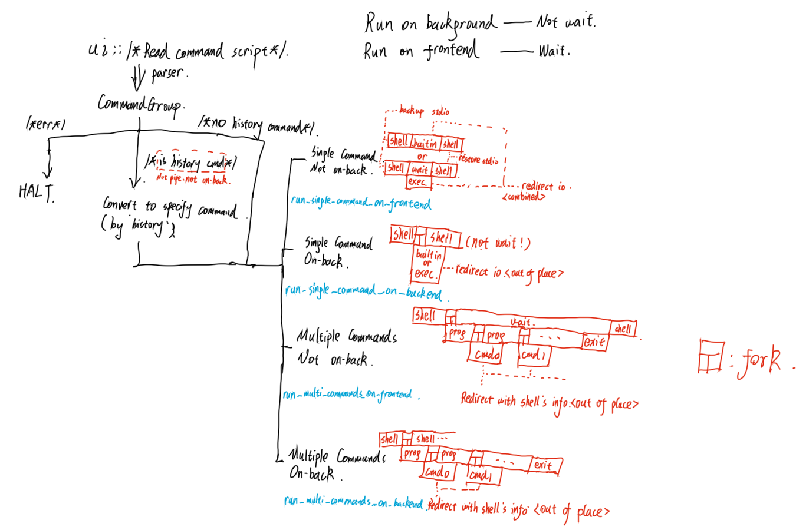

# 基本情况

## 环境和编程语言

实验环境：

* 机器：MacBook Pro (15-inch, 2019)

* 操作系统：macOS Monterey 版本12.5.1(21G83)

  经过测试，几乎不需要配其他的环境。

编程语言和相关环境：

* 使用`Rust`，2021 edition。

* 使用的crate包括：

  `pest`： 一个语法分析器，可以方便地将输入解析并传入执行器。

  `nix`：针对*nix的系统调用做了Rust的封装。

  `log4rs`：日志系统，用来debug。

* 更多包信息请参考`Cargo.toml`。

开发辅助工具：

* IDE：`vscode` with `rust-analyzer`


## 实现的功能

* 常见内部命令，包括`cd`、`exit`、`kill`、`echo`、`pwd` 、`history` 、`!!`、`!`。

* 外部命令执行。

* pipe。比如`ls -a | grep "a" | sort`这类命令。

* 文件重定向。比如`grep "a" < buffer.txt > res.txt`。

  文件重定向可以和pipe一起起作用，比如`ls -a | grep "a" > buffer.txt`，但是像`ls -a | grep "a" < buffer.txt`这类的就无法正常工作——我会在pipe之后直接重定向，这会导致`broken pipe`。

* 后台执行：比如`tree / | grep "admin" > buffer.txt &`会将`tree`和`grep `放后台执行。

  我没有着手解决多process对于stdout的抢占问题：具体来说，假如有下面的`main.c`编译出来的`main`：

  ```c
  int main(){
      int n=10;for(int i=1;i<=n;++i){printf("%d\n",i);sleep(1);}
  }
  ```

  在我的机器上的`zsh`上执行`./main &`，就会发现：`shell`的输出和`main`的输出混在了一起——这就是抢占的结果。我并不准备解决这个问题，所以如果想在我的shell里使用后台执行，为了防止出现混淆，最好使用重定向避免抢占输出。

* 历史功能：包括`history`和`! n`或者`!!`。

  对于`ls -a | ! 1 | grep "a"`这类语句，因为涉及到优先级问题（这个里面应该先执行`! 1`），所以没有做。实际上，所有的`! n`和`!!`类语句都只能单独执行，不允许重定向、和pipe结合。


# 总结进程控制方法

## `fork()`

`fork()`可以创造新的进程，并且复制一份完全一样的环境——唯一的不同是：对于父进程来说，`fork()`的返回值是子进程的id（如果创建失败则是负数）；对于子进程来说，`fork()`的返回值为0。

具体来说，如果我们需要新建一个process执行命令，Rust的写法如下：

```rust
fn run_command_out_of_place(kernel: &Kernel, cmd: Command, wait_for_end: bool) {
    let pid = unsafe { fork() }.unwrap();
    match pid {
        Parent { child } => {
            if wait_for_end {
                waitpid(child, None).unwrap();
            }
        }
        Child => {
            run_command_in_place(kernel, cmd);
            exit(0);	//	#
        }
    }
}
```

这里`#`处的`exit(0)`是有可能执行到的，因为如果执行的是内部命令的话，`run_command_in_place`就会返回，此时为了防止混乱，就需要再加上`exit`。


## `exec`系列system call

`exec`系列的系统调用会尝试根据穿进去的参数执行新的进程、替换当前进程。如果执行新进程失败的话，这个函数就会返回，此时需要做处理；如果成功的话，之后语句就完全不会继续执行。

```rust
execv(argv[0], argv.as_slice()).unwrap();
```

这是对应的`Rust`调用，如果调用成功，那么就会执行`argv[0]`对应的程序，否则会因为`.unwrap`直接down掉shell。


# 我的设计

## 综述

所有的设计原稿都在`docs/Some_Design_Blueprints.pdf`中，这里主要解释思想。


## 整体结构

前端读取命令后先经过parser转化成程序内数据结构，方便后端使用。

后端首先做一个检测，如果是合法的历史命令，那么就直接替换成相应的指令。

之后分成四类执行，具体可以看图，实际上就是按照“单个命令还是多个命令”、“前台执行还是后台执行”划分的。




## 关于执行命令的方式

上图中蓝色的`run_single_command_on_frontend`等都是执行方式，具体的执行方式见下。


## pipe的设计


红色是在`fork()`完之后需要做的事，包括关闭fd、重定向（用`dup2`）。


# 运行结果

我们分段展示：

* 外部命令`touch`和`ls`：

  ```
  /Users/lee/Main/Proj/On_BJTU/OS_Projects:touch buffer.txt
  /Users/lee/Main/Proj/On_BJTU/OS_Projects:ls -a
  .               .DS_Store       .gitignore      Cargo.toml      README.md       lee_shell       log4rs_lsh.yaml
  ..              .git            Cargo.lock      LICENSE.md      buffer.txt      log             target
  ```

* `pipe`命令和重定向结合（及输出结果）：

  ```
  /Users/lee/Main/Proj/On_BJTU/OS_Projects:ls -a | grep "a" | sort > buffer.txt
  /Users/lee/Main/Proj/On_BJTU/OS_Projects:cat buffer.txt
  Cargo.lock
  Cargo.toml
  log4rs_lsh.yaml
  target
  ```

* 重定向演示：

  ```
  /Users/lee/Main/Proj/On_BJTU/OS_Projects:grep "Cargo" < buffer.txt
  Cargo.lock
  Cargo.toml
  /Users/lee/Main/Proj/On_BJTU/OS_Projects:grep "pest" < Cargo.lock > buffer.txt
  /Users/lee/Main/Proj/On_BJTU/OS_Projects:cat buffer.txt
   "pest",
   "pest_derive",
  name = "pest"
  name = "pest_derive"
   "pest",
   "pest_generator",
  name = "pest_generator"
   "pest",
   "pest_meta",
  name = "pest_meta"
   "pest",
  ```

* 展示历史：

  ```
  /Users/lee/Main/Proj/On_BJTU/OS_Projects:history
  7 : touch "buffer.txt"
  6 : ls "-a"
  5 : ls "-a" | grep "a" | sort > buffer.txt
  4 : cat "buffer.txt"
  3 : grep "Cargo" < buffer.txt
  2 : grep "pest" < Cargo.lock > buffer.txt
  1 : cat "buffer.txt"
  0 : history
  ```

* 执行历史命令：

  ```
  /Users/lee/Main/Proj/On_BJTU/OS_Projects:echo "a" > buffer.txt
  /Users/lee/Main/Proj/On_BJTU/OS_Projects:history
  10 : touch "buffer.txt"
  9 : ls "-a"
  8 : ls "-a" | grep "a" | sort > buffer.txt
  7 : cat "buffer.txt"
  6 : grep "Cargo" < buffer.txt
  5 : grep "pest" < Cargo.lock > buffer.txt
  4 : cat "buffer.txt"
  3 : history
  2 : ls "-a"
  1 : echo "a" > buffer.txt
  0 : history
  /Users/lee/Main/Proj/On_BJTU/OS_Projects:! 4
  a
  /Users/lee/Main/Proj/On_BJTU/OS_Projects:!!
  a
  ```

* 组合命令在后台执行：

  ```
  /Users/lee/Main/Proj/On_BJTU/OS_Projects:tree / | grep "admin" > buffer.txt &
  /Users/lee/Main/Proj/On_BJTU/OS_Projects:ps -a
    PID TTY           TIME CMD
  24421 ttys000    0:00.03 login -pfl lee /bin/bash -c exec -la zsh /bin/zsh
  24423 ttys000    0:00.23 -zsh
  75672 ttys001    0:00.12 /bin/zsh -il
  23100 ttys002    0:00.12 target/debug/lee_shell
  23348 ttys002    0:00.00 (lee_shell)
  23349 ttys002    0:00.98 /usr/local/bin/tree /
  23350 ttys002    0:00.04 /usr/bin/grep admin
  23358 ttys002    0:00.00 /bin/ps -a
  44759 ttys004    0:00.02 login -pfl lee /bin/bash -c exec -la zsh /bin/zsh
  44760 ttys004    0:00.14 -zsh
  /Users/lee/Main/Proj/On_BJTU/OS_Projects:wc -l buffer.txt
       119 buffer.txt
  ```

* 执行内部命令：

  ```
  /Users/lee/Main/Proj/On_BJTU/OS_Projects:cd ..
  /Users/lee/Main/Proj/On_BJTU:ls
  OS_Projects
  /Users/lee/Main/Proj/On_BJTU:ls OS_Projects
  Cargo.lock      LICENSE.md      buffer.txt      log             target
  Cargo.toml      README.md       lee_shell       log4rs_lsh.yaml
  /Users/lee/Main/Proj/On_BJTU:cd OS_Projects
  /Users/lee/Main/Proj/On_BJTU/OS_Projects:
  ```


# 代码中的问题和解决方案

* 之前实验后台执行时，会遇到输出紊乱的情况：在执行一次后台命令后，再执行前台命令时，输出会和shell的输出冲突，大概情况如下：

  ```
  /Users/lee/Main/Proj/On_BJTU/OS_Projects:echo "a" > buffer.txt &
  /Users/lee/Main/Proj/On_BJTU/OS_Projects:ls
  /Users/lee/Main/Proj/On_BJTU:Cargo.lock      LICENSE.md      buffer.txt      log             target
  Cargo.toml      README.md       lee_shell       log4rs_lsh.yaml
  ```

  后来经过查证，是我对`wait()`的理解有问题：我以为`wait()`是等所有的子进程都结束，但是实际上是收集某一个僵尸状态的子进程状态（如果没有就等待）。


